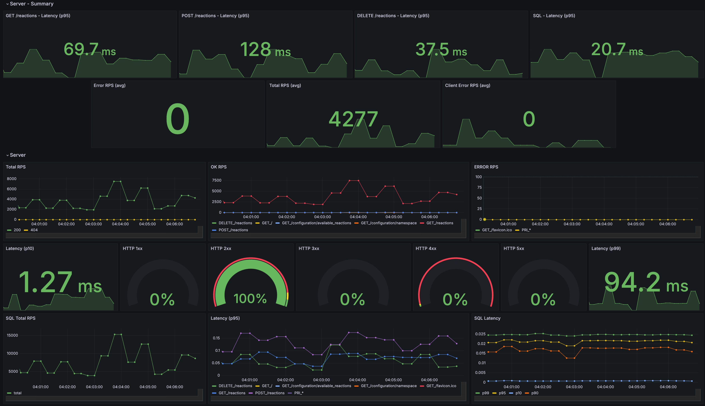

# Reactions Storage

_HSE University Diploma Project_

<!-- <div align="center"> -->
A general-purpose service for storing, managing and retrieving user reactions in efficient yet flexible manner.
<!-- </div> -->

## Paper

* TODO: link

## Features

* Power for handling thousands of RPS
* Flexible reactions configuration
* Optimized database settings
* Fine-grained server configuration
* Real-world load simulation with user-defined workloads
* Comprehensive documentation with step-by-step tutorials
* Support for 3 different deployment types (local, docker and VM)
* Integrations with Grafana, Prometheus, Pushgateway and Node Exporters
* Exhaustive Grafana dashboards out of the box
* Load testing observations with automated metrics capturing
* Grafana dashboards backups are saved and loaded with a single command
* Automated Flame Graphs generation
* Thorough end-to-end test coverage

## Performance



## Quick Start

* Install dependencies

```bash
go get
```

* Set environment variables

```bash
cp .env.template .env
# fill .env file
```

* Launch server

```bash
. devtools/exenv .env  # export env variables
make run
```

* Run tests

```bash
. devtools/exenv .env # export env variables
make test
```

## Manual

* Detailed documentation can be found in the [Manual](docs/manual/README.md).

### Reactions Storage Server

* Reactions Storage server — an HTTP web server that handles all incoming requests

* It requires configuration file and environment variables

  (see [Reactions Storage Server](docs/manual/sections/reactions_storage.md) section of [Manual](docs/manual/README.md))

### Deployment (enables running locally, with docker-compose or via remote VMs)

* Deployment setup allows you to deploy, start and stop any of supported resources (such as server or database) with a single command in any available environment (local, docker-compose and remotely)

  (see [Deployment](docs/manual/sections/deployment.md) section of [Manual](docs/manual/README.md))

### Simulation

* Simulation — a tool written in Go for conducting load tests with user-defined workloads.

  (see [Simulation](docs/manual/sections/simulation.md) section of [Manual](docs/manual/README.md))
