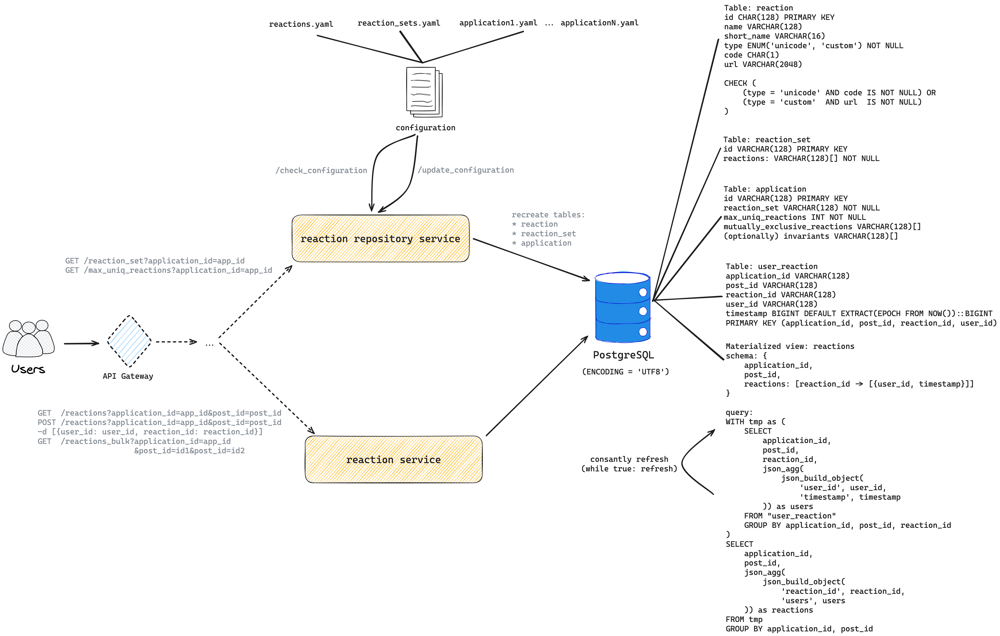

# Design V1

## Requirements

### Non-Functional

* Availability

* Flexibility

* Durability

* Low latency

### Functional

* Get/Add/Remove reactions for a post
* Manage reactions repository and applications configurations (via a set of dynamic configs or (optionally) admin web UI)
  * CRUD reaction, reaction_set, application
    * `POST /configuration -d <new_configuration_files.zip>`
    * `GET /reaction_set?application_id=app_id`
    * etc
  * Configure set of rules for an application
    * set max unique reactions
    * set mutually exclusive reactions
    * (optionally) set arbitrary invariants using user-defined golang functions
* (optionally) View who and how reacted to a post (event log)
* (optionally) Dispatch successful/unsuccesful reaction events
* (optionally) Admin page to manage reactions and view statistics
* (optionally) JS client
* (optionally) rate limiter
* (optionally) monitoring
* TODO: (optionally) Permissions (Authorization; like Discord has a ADD_REACTIONS permission or MANAGE_MESSAGES permission to delete others reactions) + pubilc API for end users (auth is out of scope, but public API will receive request with permissions) + authentication for servers (oauth token with permissions for another server to be able to put the whole api in public network)

#### Notes

* No real-time updates (WebSockets)

## Load Estimation

### Summary

* Read RPS: 3500
* Write RPS: 70
* Storage size: 40GB
* Reactions total (row count): 10B
* Network load: 14MB/s

### Calculations

* DAU: up to 30M
* User views posts per day (estimation): 10

* Engagement rate (estimation): 1%
  * [Quora](https://www.quora.com/What-is-the-average-number-of-likes-per-post-on-Instagram): Instagram estimation rate: 10-40%
  * [Hootsuite post](https://blog.hootsuite.com/average-engagement-rate/): Avg overall: 1-2%
  * [Hootsuite post 2](https://blog.hootsuite.com/instagram-statistics/): Instagram avg post engagement rate: 0.6%
  * [Socialpilot](https://www.socialpilot.co/blog/social-media-statistics):
    * Instagram avg engagement rate: 0.71%
    * Facebook avg engagement rate: 0.07%
* Avg user reactions per post: 2
* User reactions per day: 0.2 = 10 * 1% * 2
* Reactions per day: 6M = 30M * 0.2
* Reactions per second: 70 = 6M / (24 * 3600)
* $\Longrightarrow$ Write RPS = 70
* Views posts per second: = 30M * 10 / (24 * 3600)
* $\Longrightarrow$ Read RPS = 3500
* Posts per year: 1M
* Posts total: 10M
* Avg reactions per post (estimation): 1000 (since they are global)
* Avg post reactions dict size: 4KB = 4000B = 1000 * 40byte = 1000 * (16byte (reactionid) + 16byte (userid) + 8byte (timestamp))
* $\Longrightarrow$ Storage size: 40GB = 10M * 4KB
* $\Longrightarrow$ Reactions total (row count): 10B = 10M * 1000 
  * Postgres rows per table limit: $>>$ 1T (limited by the number of tuples that can fit onto 4,294,967,295 pages)
* $\Longrightarrow$ Network load: 14MB/s = 3500 * 4KB/s (write RPS is low)

## High-level design (Iteration I)

## Implementation

* Add reaction algorithm
  * check operation was not processed using idempotency key (preliminary check, optimization)
  * get mutually_exclusive_reactions inds for current application
  * get max_uniq_cnt for current application
  * begin pg transaction
  * lock post_id
  * check operation was not processed using idempotency key
  * check if reaction is not excluded by others, otherwise exit (join over post_id, user_id)
  * insert row (post_id, reaction_id, user_id, timestamp)
  * check that uniq_cnt <= max_uniq_cnt, otherwise rollback (join over post_id)
  * store idempotancy key (or event into event log)
  * unlock post_id
  * commit pg transaction
  
* Adding a reaction inside a scope of (post_id) should be ordered (max unique reactions force it):

  * Implement a distributed lock with postgresql `pg_advisory_lock` + `pg_advisory_unlock`  (inside transaction no explicit unlock is required)

* Adding reaction inside a scope of a (post_id, user_id) should be ordered (mutually exclusive reactions force it)

  * Implement a distributed lock with postgresql `pg_advisory_lock` + `pg_advisory_unlock`  (inside transaction no explicit unlock is required)

* Handle ABA case: Add, Remove, Add

  * Approaches

    1. Timestamp in update request (BUT user can put wrong timestamp and potentially crack the system)

    2. Generate timestamp on request receiving (still vulnerable to ABA, but reduces its possibility)
    3. Generate timestamp on request receiving in the first node of the whole system (with big infrastructure there are always nodes close to users and they can generate valid timestamp close to real time when user clicked the button)
    4. Send reactions in batch and delay sending (still vulnerable to ABA, but greatly reduces its possibility: e.g. with delay=5s Remove should be delivered 5 seconds later of expected time which is very unlikely)

* Handle ABA case 2: Add, Remove, Add (retry), Remove (retry)

  * Idempotency key (event_id)

* (optionally) Arbitrary invariants using user-defined golang functions implementation: write function that receives (), and returns bool, put it into XXX package, write into configuration name of your function, it will be called using `reflect.ValueOf(functionName).MethodByName(functionName)`

### Entities

* Reaction — entity with id and either unicode code or url to static image TODOxTODO
  * Model: {id: str, name: str, short_name: str, type: Enum(Unicode, Custom), OneOf(unicode_code: int, image_url: str), animation_url: str}
  * animations: lottie files
* Reaction Set — a configurable set of reactions
* Application — a set of configurations (specifies a reaction set, reactions_uniq_max, mutually_exclusive_reactions, etc)
* Reaction Event — event of clicking a particular reaction from a particular user
* Configuration — a set of files and directories

### Database

* Table: user_reaction
  * Record: application_id, post_id, reaction_id, user_id, timestamp

* Materialized view: post_reactions
  * Record: application_id, post_id, reactions: [reaction_id -> [{user_id, timestamp}]]

#### Notes

* [Max number of bytes for a UTF-8 character](https://stackoverflow.com/questions/9533258/what-is-the-maximum-number-of-bytes-for-a-utf-8-encoded-character): 4 bytes

### Possible Optimizations

* Indexes over views and tables
* Cache (redis) in front of views and tables
* Order [{user_id, timestamp}] by user_id to find whether current user pressed this reaction faster (view "post_reactions")
* Shard DB by post_id
* Cache reactions on client and correctly invalidate cache depending on received responses
* Send multiple reactions in batch (on client after reaction click, set timer, e.g. 5 seconds, and send multiple reactions in batch)
  * +reduces possibility of Add, Remove, Add issue

* Efficiently check constraints
  * Store materialized view (post_id, uniq_reactions_cnt) and manually update when new reaction is added

* Add reactions using batch and only if batch is invalid then insert one by one and discard all invalid reactions

* Split data into cold (old posts) and warm (new posts): that will allow to quickly update materialized view with reactions for hot posts

* Return only reaction_id->count + reactions that user clicked instead of the whole dict

* Optimistic transactions first (check constraints after insertion and rollback if bad)

## Research

### Reactions Implementations

#### Telegram

* Criticism (on early stage)
  * No settings to manage reactions behaviour (disable quick-reactions, bring back double-tap context menu, disable long animations)
  * Inconsistency across platforms
* Implementation (Bard):
  * Centralized storage
  * Real-time updates with WebSocket connection
  * Polling mechanism for the latest reaction data for each message
* Implementation (Telegram API doc):
  * 1+ reactions from signle user
  * 2 flows: normal + recent_reactions (local cache; https://core.telegram.org/api/reactions#recent-reactions)
  * Polls reactions for visible messages every 15-30 seconds
  * Uses lottie animations (https://core.telegram.org/api/reactions)
  * Has [reactions_uniq_max](https://core.telegram.org/api/config#reactions-uniq-max) configuration (max uniq reactions for message)
  * Normal and custom emojis
  * [getMessagesReactions](https://core.telegram.org/method/messages.getMessagesReactions)
  * [Reaction](https://core.telegram.org/type/Reaction): empty, normal, custom
  * [messagePeerReaction](messagePeerReaction)
  * [sendReaction](https://core.telegram.org/method/messages.sendReaction): add_to_recent, peer, msg_id, list of reactions

### Discord

* Criticism
  * Mass reactions aren't supported ([github issue](https://github.com/discord/discord-api-docs/issues/1301))
  * Ghost reactions ([reddit](https://www.reddit.com/r/discordapp/comments/wn5ox3/ghost_spotted_in_dm/))
  * Frontend inconsistency ([github issue](https://github.com/discord/discord-api-docs/issues/6028))
* Implementation ([Disocrd JS client doc](https://discordjs.guide/popular-topics/reactions.html#reacting-to-messages)):
  * React using unicode emoji or id of custom emoji
  * Client has cache with reactions
  * Allows to listen for reactions on messages
* Implementation ([Discord API doc](https://discord.com/developers/docs/resources/channel#create-reaction)):
  * Custom emoji has name + id
  * GetReactions has after and limit params
    * after — reactions of users with ID $\ge$ given (snowflake ID is used)
    * liimt — max number of users to return (1-100, default: 25)
  * Different max unique reactions depending on server level

### Facebook

* Criticism
  * Limited set of reactions
  * reactions like SAD, HAHA, SHOCK affect author's psychological well-being
* Implementation animation example: [medium post](https://medium.com/@huydotnet/implementing-facebooks-reaction-animation-9ab05460d9f7)
* Implementation ([Facebook API doc](https://developers.facebook.com/docs/graph-api/reference/v18.0/object/reactions)):
  * GetReactions returns list of {user_id, user_name, reaction_type}
  * GetReactions has paging with user_id (before, after)
  * reaction_type is a string
